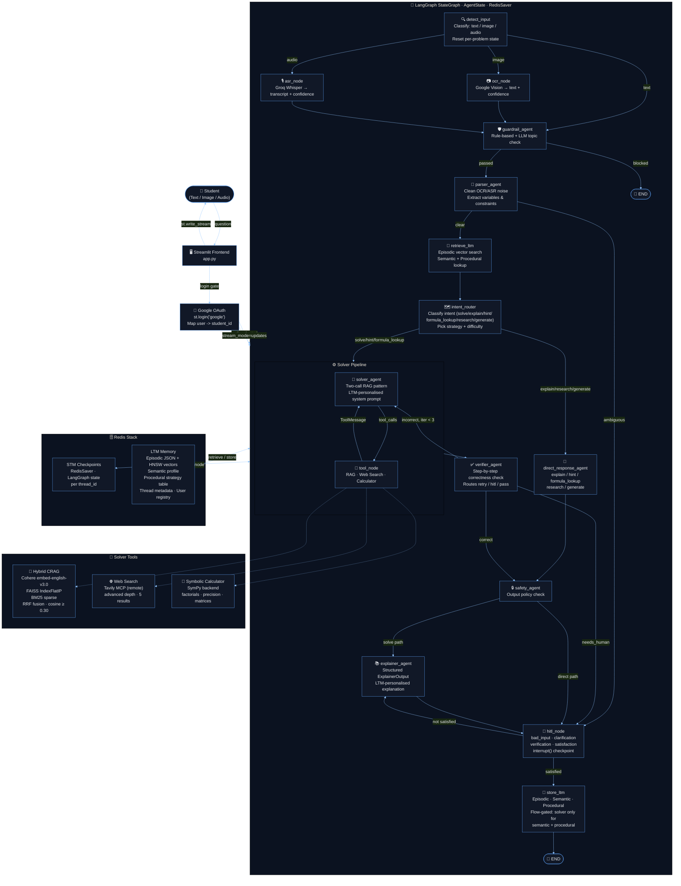

# 🧮 JEE Math Tutor Agent

> An AI-powered mathematics tutor for JEE preparation, built on a multi-agent LangGraph pipeline with persistent long-term memory, hybrid C-RAG, real-time web search using tavily mcp, and a Neo4j-style interactive memory visualiser.

---

**🔗 Live Demo:** *[Add your deployed URL here]*  
**📸 Screenshot / Demo GIF:** *[Add image here]*

---

## Table of Contents

- [Overview](#overview)
- [Features](#features)
- [Architecture](#architecture)
- [Agent Pipeline](#agent-pipeline)
- [Memory System](#memory-system)
- [RAG — Hybrid CRAG](#rag--hybrid-crag)
- [Tools](#tools)
- [Memory Visualiser](#memory-visualiser)
- [What We Store in Redis](#what-we-store-in-redis)
- [Project Structure](#project-structure)
- [Setup & Installation](#setup--installation)
- [Running the App](#running-the-app)
- [Testing](#testing)
- [Deployment](#deployment)
- [What We Tried (But Didn't Work Out)](#what-we-tried-but-didnt-work-out)
- [Known Limitations](#known-limitations)
- [Scope for Further Advancement](#scope-for-further-advancement)
- [Tech Stack](#tech-stack)

---

## Overview

JEE Math Tutor is a full-stack AI tutoring system that goes well beyond a simple chat interface. It accepts text, image (OCR), or audio (ASR) input, routes the student's intent intelligently, solves problems step-by-step using a ReAct tool loop, verifies its own answers with a dedicated critic agent, and generates rich personalised explanations. 

The system remembers students across sessions — tracking which topics they struggle with, which solving strategies work for them, and what mistakes they commonly make — and uses that memory to personalise every response.

Authentication uses Streamlit's native Google OIDC flow (`st.login("google")` + `.streamlit/secrets.toml` auth block). On login, each user is mapped to a stable Redis `student_id` namespace via `get_or_create_user`, so memory, threads, and checkpoints stay isolated per student.

For non-solve intents (`explain`, `research`, `generate`), the graph routes to `direct_response_agent`, which writes `final_response` and optional `direct_response_tool_calls` into state. The frontend stream handler reads these updates and renders the assistant answer directly in the chat UI, while also showing activity-panel tool cards for web-search-backed responses.

---

## Features

Compared to the original single-agent version described in the README, the system has been substantially upgraded:

- **Full LTM (Long-Term Memory)** across sessions: episodic, semantic, and procedural memory stored in Redis with vector similarity search
- **Intent routing**: six distinct intents (solve, explain, hint, formula_lookup, research, generate) with separate pipelines
- **Direct Response Agent** for non-solve intents — skips the verifier/explainer pipeline entirely
- **Hybrid CRAG** — BM25 sparse + Cohere dense + Reciprocal Rank Fusion, with corrective relevance filtering
- **Two-API-key architecture** — separates the solver from all other agents to avoid Groq rate limits
- **STM trimming** — rolling LLM summarisation keeps the context window under 8k tokens without losing history
- **Interactive memory graph** — Neo4j-style vis.js visualisation of the student's entire memory graph
- **Google OAuth** — full authentication with per-student Redis namespacing
- **Safety agent** — output-level policy check before any response reaches the student
- **Activity panel** — live sidebar showing every agent node, tool call, and payload as it streams

---

## Architecture



**Source file reference:**

| Node | File |
|------|------|
| Frontend entry | [`src/frontend/app.py`](src/frontend/app.py) |
| Graph | [`src/backend/agents/graph.py`](src/backend/agents/graph.py) |
| Input / OCR / ASR | [`src/backend/agents/nodes/input.py`](src/backend/agents/nodes/input.py) |
| Guardrail | [`src/backend/agents/nodes/guardrail.py`](src/backend/agents/nodes/guardrail.py) |
| Parser | [`src/backend/agents/nodes/parser.py`](src/backend/agents/nodes/parser.py) |
| Intent Router | [`src/backend/agents/nodes/router.py`](src/backend/agents/nodes/router.py) |
| Solver | [`src/backend/agents/nodes/solver.py`](src/backend/agents/nodes/solver.py) |
| Verifier | [`src/backend/agents/nodes/verifier.py`](src/backend/agents/nodes/verifier.py) |
| Safety | [`src/backend/agents/nodes/safety.py`](src/backend/agents/nodes/safety.py) |
| Explainer | [`src/backend/agents/nodes/explainer.py`](src/backend/agents/nodes/explainer.py) |
| Direct Response | [`src/backend/agents/nodes/direct_response.py`](src/backend/agents/nodes/direct_response.py) |
| HITL | [`src/backend/agents/nodes/hitl.py`](src/backend/agents/nodes/hitl.py) |
| Memory Manager | [`src/backend/agents/nodes/memory/memory_manager.py`](src/backend/agents/nodes/memory/memory_manager.py) |

---

## Agent Pipeline

The graph has 14 nodes. Here is what each one does and what it writes to state.

### 1. `detect_input`

Classifies the incoming input as `text`, `image`, or `audio`. Resets all per-problem state fields (solve_iterations, hitl flags, messages, etc.) so a new question always starts clean. Routes to OCR/ASR nodes or directly to the guardrail.

### 2. `ocr_node` / `asr_node`

OCR uses Google Cloud Vision API. ASR uses Groq Whisper (`whisper-large-v3`). Both produce a confidence score. If confidence falls below 0.5 or the extracted text is empty, a `bad_input` HITL is triggered.

### 3. `guardrail_agent`

Two-stage input safety check:

- **Stage 1 (rule-based):** Pattern matches for prompt injection, extraction attempts, and PII (email, phone, Aadhaar). Zero LLM cost.
- **Stage 2 (LLM):** LLaMA 3.3 70B checks topic relevance against `topic_policy.yaml`. Passes anything where mathematics is even loosely the subject. When in doubt, passes — false positives are far more costly than false negatives.

### 4. `parser_agent`

Cleans OCR/ASR noise, normalises math notation (fractions, exponents, Greek letters, integrals), extracts variables and constraints. Sets `needs_clarification=True` only when the problem is genuinely unsolvable without more information — not for hard or unusual problems. Routes to HITL if clarification is needed, otherwise to `retrieve_ltm`.

### 5. `retrieve_ltm`

Runs before the intent router so the solver always has student context available. Three independent lookups:

- **Episodic:** Cohere vector search over past solved problems for this student, filtered by `student_id` tag in the HNSW index
- **Semantic:** Reads `weak_topics`, `strong_topics`, `mistake_patterns` from the student's semantic profile
- **Procedural:** Finds the highest-success-rate strategy for the current topic

Writes `ltm_context` to state. Populates the activity panel with a full breakdown.

### 6. `intent_router`

Classifies the student's intent into one of six categories and picks a solving strategy. Routes solve/hint/formula_lookup to the solver pipeline and explain/research/generate to the direct response agent. Also sets topic, difficulty, and solver_strategy in `solution_plan`.

### 7. `solver_agent` (ReAct loop)

The most complex node. Two separate LLM calls when a PDF is uploaded:

- **Call 1:** Forces `rag_tool` as the first action via `tool_choice` — the LLM must retrieve relevant passages from the student's notes before writing anything
- **Call 2:** Receives RAG context as a plain `HumanMessage` (not a tool message) to avoid Groq's tool validation, then writes the full solution using `[calc, web]` only

On retry iterations, RAG is skipped and verifier feedback is injected. The system prompt is personalised with LTM context (best strategy, weak areas, known mistakes, similar past problems). Uses a second Groq API key to avoid rate limiting the other agents.

### 8. `tool_node`

LangGraph's built-in `ToolNode` executing calculator and web search tool calls from the solver's ReAct loop. RAG is handled inline in `solver_agent` itself (not through this node) to avoid tool validation issues with Groq.

### 9. `verifier_agent`

Checks the solution on three criteria: step-by-step algebraic correctness (citing specific step numbers for errors), units and domain validity, and edge cases (division by zero, undefined log/sqrt, empty set). Routes to safety (correct), retry (incorrect, up to 3 attempts), or HITL (needs human expert).

### 10. `direct_response_agent`

Handles all non-solve intents with a single LLM call. For research and generate intents, calls Tavily web search synchronously before building the prompt. Returns structured markdown. Writes stub solver/verifier outputs so downstream nodes (store_ltm) don't crash.

### 11. `safety_agent`

Output-level policy check against `output_policy.yaml`. Two-stage: keyword fast path (no LLM cost) then LLM check. Only fires after the verifier confirms correctness — prevents harmful content from reaching the student even if the solver was somehow manipulated.

### 12. `explainer_agent`

Produces a structured `ExplainerOutput` (approach summary, step-by-step working with headings, key formulae, key concepts, common mistakes, difficulty rating). Personalises the explanation using LTM — if the student has struggled with this topic or made specific mistakes before, those are called out explicitly. Renders to rich markdown with LaTeX.

### 13. `hitl_node`

Single suspension point for all human-in-the-loop scenarios. Uses LangGraph's `interrupt()` to checkpoint state and pause — the student's browser can close and reopen and the graph resumes exactly where it left off. Four HITL types: `bad_input`, `clarification`, `verification`, `satisfaction`.

### 14. `store_ltm`

Called only when `student_satisfied=True`. Writes to three memory stores with a critical flow gate: episodic memory is written for all flows, but semantic and procedural memory are written **only** for solver-flow intents (solve/hint/formula_lookup). This prevents research-style strategy strings from polluting procedural memory.

---

## Memory System

The memory system has three layers, each serving a different purpose.

### Short-Term Memory (STM)

**What:** The live conversation state for one problem-solving session.  
**Where:** Redis via LangGraph's `RedisSaver` checkpointer. Every node writes its output to a checkpoint automatically.  
**Key pattern:** `checkpoint:<thread_id>:`*  
**TTL:** 2 hours (matches `STM_SUMMARY_TTL`)  
**Trimming:** When the message list exceeds 8,000 tokens (tiktoken gpt-4o encoding), older messages are summarised by a separate LLM call and replaced with a single `AIMessage` containing the rolling summary. The last 6 messages are always kept verbatim. The summary is also persisted to Redis at `stm:summary:<thread_id>` so it survives restarts within the TTL window.

### Long-Term Memory (LTM)

LTM spans sessions and is written at the end of each solved problem when the student confirms satisfaction.

#### Episodic Memory

**What:** One record per solved problem — a "memory of what happened."  
**Where:** Redis JSON + RedisVL HNSW vector index  
**Key pattern:** `episodic:<student_id>:<episode_id>`  
**TTL:** 90 days  
**What's stored per episode:**


| Field             | Description                                                          |
| ----------------- | -------------------------------------------------------------------- |
| `student_id`      | Hashed student identifier                                            |
| `episode_id`      | Millisecond timestamp (unique)                                       |
| `topic`           | e.g. `geometry`, `calculus`                                          |
| `difficulty`      | `easy` | `medium` | `hard`                                           |
| `problem_summary` | First 200 chars of problem text                                      |
| `final_answer`    | e.g. `π/4`, `x = 3`                                                  |
| `outcome`         | `correct` | `incorrect` | `hitl` | `completed`                       |
| `solve_attempts`  | How many solver retries were needed                                  |
| `timestamp`       | Unix time of storage                                                 |
| `access_count`    | Incremented each time this episode is retrieved                      |
| `decay_score`     | Spaced-repetition forgetting curve score                             |
| `embedding`       | 1024-dim Cohere float32 vector of `"{topic} {difficulty} {summary}"` |


**Retrieval:** At the start of each new problem, the system embeds `"{topic} {problem_text[:200]}"` and runs a vector similarity search (HNSW, cosine) filtered by `student_id`. The top 3 most similar past problems are injected into the solver's system prompt.

**Decay:** `decay_score = e^(-days_old / 30) × log(1 + access_count + 1)`. Episodes retrieved often decay much more slowly (spaced repetition effect). Episodes below threshold (0.05) and older than 30 days are pruned manually via the admin panel.

#### Semantic Memory

**What:** The student's topic-level strength/weakness profile.  
**Where:** Redis JSON  
**Key pattern:** `semantic:<student_id>`  
**TTL:** None (permanent)  
**What's stored:**


| Field              | Description                                                |
| ------------------ | ---------------------------------------------------------- |
| `weak_topics`      | `{topic: fail_count}` — incremented on incorrect attempts  |
| `strong_topics`    | `{topic: success_count}` — incremented on correct outcomes |
| `mistake_patterns` | `[{pattern, topic, count}]` — deduped by (pattern, topic)  |


**Struggle signal:** Since `store_ltm` is only reached after a correct outcome, a multi-attempt session is handled by writing `solve_attempts - 1` "incorrect" passes first, then the final "correct" pass. This is the only way to populate `weak_topics` without catching mid-session failures.

#### Procedural Memory

**What:** Which solving strategies work for this student on which topics.  
**Where:** Redis JSON  
**Key pattern:** `procedural:<student_id>`  
**TTL:** None (permanent)  
**What's stored:**

```json
{
  "strategy_success": {
    "geometry": {
      "Use the distance formula and verify collinearity": {
        "success_count": 3,
        "total_count": 4,
        "attempts_sum": 5,
        "success_rate": 0.75,
        "attempts_avg": 1.25
      }
    }
  }
}
```

**Best strategy selection:** `max(strategies, key=lambda kv: (success_rate, -attempts_avg))` — prefers high success rate, breaks ties by fewest average attempts.

**Flow gate:** Only solver-flow intents write to procedural memory. Research/generate strategy strings (e.g. "Use web search to find examples…") are explicitly blocked by checking `intent_type in ("solve", "hint", "formula_lookup")` before every write. A secondary guard inside `update_procedural_memory` rejects strings over 120 characters or containing research keywords as a defence-in-depth measure.

---

## RAG — Hybrid CRAG

The RAG system is a Corrective Retrieval-Augmented Generation (CRAG) pipeline that searches the student's uploaded PDF notes.

**Ingestion:** `PyPDFLoader` → `RecursiveCharacterTextSplitter` (800 chars, 150 overlap) → Cohere `embed-english-v3.0` → `FAISS IndexFlatIP` (in-memory, per thread). Calling ingest a second time appends to the existing index — all uploaded PDFs are searched together.

**Retrieval pipeline:**

1. **Dense retrieval:** Embed query with Cohere (query mode), search FAISS index for top 10 by cosine similarity
2. **Sparse retrieval:** BM25Okapi on tokenised chunks, top 10 by BM25 score
3. **Reciprocal Rank Fusion:** Merge dense and sparse rankings with `score = 1/(K + rank)` where K=60, take top 5
4. **Corrective filter:** Drop any chunk with cosine similarity < 0.30 — these are almost certainly off-topic. This is the "C" in CRAG.

**Two-call pattern in solver:** To avoid Groq's tool validation error (which requires a ToolMessage for every AIMessage with tool_calls), RAG is handled inline rather than through the graph's ToolNode:

- Call 1 forces `rag_tool` via `tool_choice`
- The solver intercepts the tool call, executes RAG directly, then builds `messages_for_call2` with the RAG result injected as a plain `HumanMessage` with a sentinel prefix `[RAG context retrieved from student's notes]`
- Call 2 binds only `[calculator, web_search]` — no rag_tool — and writes the full solution

**Query strategy:** The LLM is instructed to query by concept/theorem/formula name (e.g. "Bayes theorem", "integration by parts formula") NOT by problem text. This ensures retrieval works even when the student's notes contain the formula without a matching example problem.

---

## Tools


| Tool              | When to use                                                                   | Backend                               |
| ----------------- | ----------------------------------------------------------------------------- | ------------------------------------- |
| `rag_tool`        | First call on every problem when a PDF is uploaded                            | Cohere + FAISS + BM25                 |
| `web_search_tool` | Recent discoveries, new JEE questions, theory lookups, when RAG returns empty | Tavily MCP (remote, `mcp.tavily.com`) |
| `calculator_tool` | Large factorials, high-precision decimals, large matrix operations ONLY       | SymPy                                 |


### 🌐 Tavily MCP — Real-Time Web Search

Web search is handled through the **Tavily MCP server** (`mcp.tavily.com`) — a remote MCP endpoint that requires no local setup. The solver calls it via `tavily_mcp_search`, which wraps the MCP client call with `search_depth="advanced"` and returns a Tavily AI direct answer along with the top 5 ranked results (title, URL, snippet).

**Multi-query strategy — up to 3 calls per turn:**

The solver is instructed to decompose a research task into up to three focused, distinct queries rather than firing one broad query:

- **Query 1** → core formula, theorem, or concept
- **Query 2** → worked example or step-by-step solution
- **Query 3** → edge case, common mistake, or real application (only if needed)

This mirrors how a student would actually research a topic — first understanding the principle, then seeing it applied, then stress-testing the understanding. Each query is narrow and specific so Tavily's advanced search mode can surface high-quality results rather than generic overviews.

**When the solver calls `web_search_tool`:**
- Student asks about recent JEE Mains / Advanced questions on a topic
- Student asks about math Olympiad problems (IMO, Putnam, USAMO, RMO)
- Student asks for study resources, textbooks, or video explanations
- CRAG returned empty or insufficient context
- Any question requiring current or up-to-date information

**When it should NOT be called:**
- For computing math — use own reasoning or `calculator_tool` instead
- For topics already covered by the student's uploaded notes — `rag_tool` takes priority

---

### 🐍 Symbolic Calculator — SymPy Backend

The `calculator_tool` wraps **SymPy** and is intentionally scoped to a narrow set of cases where symbolic or high-precision computation adds real value over the LLM's own arithmetic. The solver handles all routine JEE-level computation itself; the calculator is only invoked when the LLM's floating-point reasoning would be unreliable or slow.

**The three valid use cases:**

1. **Very large factorials / combinatorics** — e.g. `binomial(50, 25)`, `factorial(100)`. These produce exact integers that are impractical to compute by hand or by LLM token prediction.
2. **High-precision decimal results** — e.g. `N(integrate(1/sqrt(1-x**2), x), 50)` for a 50-digit result when the problem explicitly demands precision beyond standard floating point.
3. **Large matrix operations** — determinants, inverses, and eigenvalues for matrices too large to expand symbolically in-context: e.g. `Matrix([[1,2,3],[4,5,6],[7,8,9]]).det()`.

The tool calls `sp.sympify(expression)` followed by `sp.N(expr)` and returns the result as a plain string. Errors are caught and returned with a hint to check SymPy syntax, so a malformed expression never crashes the agent turn.

**Expression syntax (valid SymPy strings):**
```
binomial(50, 25)
factorial(100)
N(integrate(1/sqrt(1-x**2), x), 50)
Matrix([[1,2,3],[4,5,6],[7,8,9]]).det()
```

> **Note:** The calculator does **not** have NumPy available. Use SymPy-native equivalents: `binomial(n,k)`, `factorial(n)`, `Matrix([[...]]).det()`, `sqrt(x)` etc. Passing NumPy expressions will raise a calculator error.

---

## Memory Visualiser

The memory visualiser at `/pages/memory_viz.py` renders the student's complete memory graph as an interactive Neo4j-style network using vis.js.

**What it shows:**

- Student root node (star shape) with profile data
- Session thread nodes (hexagon) — one per conversation
- Agent nodes per thread — showing every node that ran and its payload
- Tool call nodes — every RAG/web search/calculator call
- Episodic memory nodes — one per solved problem, showing topic, difficulty, outcome, answer, decay score
- Semantic profile node — with weak/strong topic children and mistake pattern children
- Procedural profile node — with per-topic strategy children showing success rates

**Interactivity:**

- Click any node to open a detail panel on the right with all stored fields
- Double-click a node to select and fit to its direct neighbours
- Hover for glow effect and tooltip
- Physics engine (forceAtlas2 / barnesHut / repulsion) with live stabilisation — freeze when stable
- Four layout presets: Radial, Hierarchical, Organic spread, Tight cluster
- Toggle node labels (L key), fit graph (F key), close panel (Esc)
- Export graph as PNG
- Filter by node type — hide agent/tool nodes for a cleaner LTM-only view
- Adjust max threads shown (1–30)
- Decay score colour-coded: green (≥ 0.6), yellow (≥ 0.3), red (< 0.3)


---

## What We Store in Redis

```
Redis Stack
│
├── STM (LangGraph checkpointer)
│   └── checkpoint:<thread_id>:*           LangGraph state snapshots
│   └── stm:summary:<thread_id>            Rolling LLM summary, TTL 2h
│
├── User Registry
│   └── user:<student_id>                  Hash: name, email, problems_solved, timestamps
│   └── threads:<student_id>               Sorted set: thread_ids scored by timestamp
│
├── Thread Metadata
│   └── thread:<thread_id>:meta            Hash: problem_summary, topic, outcome, timestamps
│
├── Episodic LTM
│   └── episodic:<student_id>:<episode_id> JSON doc + HNSW vector (1024-dim float32)
│   └── idx:episodic                       RedisVL HNSW vector index (COSINE, FLOAT32)
│
├── Semantic LTM
│   └── semantic:<student_id>              JSON: weak_topics, strong_topics, mistake_patterns
│
└── Procedural LTM
    └── procedural:<student_id>            JSON: strategy_success per topic
```

**RedisInsight UI** is available at `http://localhost:8001` when running via Docker Compose — useful for inspecting all keys, running queries, and monitoring memory usage.

---

## Project Structure

```
MathTutor/
├── src/
│   ├── backend/
│   │   ├── __init__.py
│   │   ├── exceptions/
│   │   │   └── __init__.py              Agent_Exception with file + line info
│   │   ├── logger/
│   │   │   └── __init__.py              Timestamped file logger (logs/ dir)
│   │   └── agents/
│   │       ├── __init__.py              Shared imports: messages, typing, logger
│   │       ├── base.py                  BaseAgent — two ChatGroq clients + MediaProcessor
│   │       ├── graph.py                 LangGraph StateGraph — all nodes + routing functions
│   │       ├── state.py                 AgentState TypedDict + make_initial_state()
│   │       ├── nodes/
│   │       │   ├── __init__.py          Node-level shared imports + artifact schemas
│   │       │   ├── input.py             detect_input_type, ocr_node, asr_node
│   │       │   ├── guardrail.py         GuardrailAgent — rule-based + LLM topic check
│   │       │   ├── parser.py            ParserAgent — clean + structure problem text
│   │       │   ├── router.py            IntentRouterAgent — six-intent classification
│   │       │   ├── solver.py            SolverAgent — two-call RAG + ReAct loop
│   │       │   ├── verifier.py          VerifierAgent — three-criteria correctness check
│   │       │   ├── safety.py            SafetyAgent — output policy enforcement
│   │       │   ├── explainer.py         ExplainerAgent — structured personalised explanation
│   │       │   ├── direct_response.py   DirectResponseAgent — explain/hint/research/generate
│   │       │   ├── hitl.py              HITLAgent — interrupt() + four HITL types
│   │       │   ├── memory/
│   │       │   │   ├── __init__.py      Redis URLs, TTLs, token limits, index schema
│   │       │   │   └── memory_manager.py STM trimming, episodic/semantic/procedural R/W
│   │       │   ├── tools/
│   │       │   │   ├── __init__.py      Cohere model constants, TOP_K, MIN_SCORE
│   │       │   │   ├── tools.py         rag_tool, web_search_tool, calculator_tool, ingest_pdf
│   │       │   │   └── mcp/
│   │       │   │       ├── __init__.py  Tavily MCP constants
│   │       │   │       └── tavily_mcp_client.py  Async Tavily MCP → sync wrapper
│   │       │   └── security_checks/
│   │       │       ├── topic_policy.yaml       Allowed/blocked topics for guardrail
│   │       │       ├── injection_patterns.yaml Prompt injection + extraction patterns
│   │       │       └── output_policy.yaml      Output safety patterns
│   │       └── utils/
│   │           ├── ___init__.py
│   │           ├── artifacts.py         Pydantic schemas: Parser/Router/Verifier/Explainer/Safety
│   │           ├── db_utils.py          Redis singletons, key helpers, user/thread registry, STM
│   │           ├── helper.py            MediaProcessor (OCR/ASR), _log_payload, _render_markdown
│   │           └── memory_graph_reader.py  Builds vis.js {nodes, edges} from Redis data
│   ├── frontend/
│   │   ├── __init__.py                  AGENT_META, TOOL_META, ANSWER_NODES, HITL prefixes
│   │   ├── app.py                       Main Streamlit app — streaming, HITL, activity panel
│   │   ├── pages/
│   │   │   ├── __init__.py              vis.js visual constants (colours, sizes, shapes)
│   │   │   ├── memory_viz.py            Memory graph Streamlit page
│   │   │   ├── graph.html               vis.js HTML template with %%TOKEN%% injection
│   │   │   ├── graph.css                Neo4j-style dark theme CSS
│   │   │   └── graph.js                 vis.js network init + interaction logic
│   │   └── templates/
│   │       ├── __init__.py
│   │       ├── activity_panel.py        Step card builder + panel renderer
│   │       ├── login.py                 Google OAuth login page
│   │       ├── profile.py               Profile card HTML builder
│   │       ├── styles.css               Global dark theme — cards, banners, tables
│   │       └── login.css                Login page specific styles
│   └── tests/
│       ├── conftest.py                                 Shared pytest fixtures and monkeypatch helpers
│       ├── unit/
│       │   ├── test_db_utils_threads_and_stm.py         Thread registry + STM summary persistence helpers
│       │   ├── test_db_utils_user_registry.py           User registry (get_or_create_user etc.) roundtrip
│       │   ├── test_direct_response_agent.py            DirectResponseAgent contract and tool-call logging
│       │   ├── test_env_example_keys.py                 Ensures .env.example includes required keys
│       │   ├── test_hitl_processors.py                  HITL processing helpers and state updates
│       │   ├── test_input_and_solver_no_api.py          Input reset + solver contracts (no external APIs)
│       │   ├── test_memory_manager_flow_gates.py        Memory manager store/retrieve routing + flow gates
│       │   ├── test_router_node_contract.py              Intent router contract (state in/out, intent labels)
│       │   └── test_state_and_policies.py               State defaults + guardrail/safety/verifier behaviors
│       │   └── test_tavily_mcp_helpers.py                Tavily MCP helper utilities (no network)
│       ├── integration/
│       │   ├── test_clarification_to_router_loop.py      Clarification HITL -> router loop integration flow
│       │   ├── test_direct_response_followup_flow.py     Direct-response follow-up question flow
│       │   └── test_memory_store_after_correct_solve.py End-to-end: solver -> verifier -> memory store (all mocked)
│       │   ├── test_router_to_direct_response_pipeline.py Router -> direct response end-to-end flow
│       │   └── test_user_registry_roundtrip.py           User registry integration roundtrip
│       └── __init__.py
├── logs/                                Timestamped log files (git-ignored)
├── uploads/                             Temporary upload staging (git-ignored)
├── secrets/                             Google service account JSON (git-ignored)
├── docker-compose.yml                   Redis Stack service
├── entrypoint.sh                        Start Streamlit (and waits for Redis)
├── run.ps1                              Windows PowerShell runner
├── .env.example                         API key template
├── .gitignore
├── pytest.ini
└── README.md
```

---

## Setup & Installation

### Prerequisites

- Python 3.11+
- Docker Desktop (for Redis Stack)
- A Google Cloud project with Vision API enabled (for OCR)
- API keys: Groq (×2 recommended), Cohere, Tavily, Google OAuth credentials

### 1. Clone the repository

```bash
git clone https://github.com/your-username/MathTutor.git
cd MathTutor
```

### 2. Create and activate a virtual environment

**Windows (PowerShell):**

```powershell
python -m venv myenv
myenv\Scripts\Activate.ps1
```

**macOS / Linux:**

```bash
python -m venv myenv
source myenv/bin/activate
```

### 3. Install dependencies

```bash
pip install -r requirements.txt
```

### 4. Start Redis Stack

```bash
docker compose up -d redis
```

Redis will be available at `localhost:6379` and RedisInsight at `http://localhost:8001`.

### 5. Configure environment variables

```bash
cp .env.example .env
```

Edit `.env`:

```env
# LLM inference
GROQ_API_KEY=gsk_...          # Primary key — guardrail, parser, router, verifier, safety, explainer
GROQ_API_KEY_2=gsk_...        # Secondary key — solver + direct_response (avoids rate limits)

# Embeddings
COHERE_API_KEY=CIy...

# Web search
TAVILY_API_KEY=tvly-...

# Redis
REDIS_URL=redis://:jee_secret@localhost:6379

# Google OAuth (Streamlit native auth)
GOOGLE_CLIENT_ID=...
GOOGLE_CLIENT_SECRET=...
OAUTH_REDIRECT_URI=http://localhost:8501/oauth2callback

# Google Vision OCR — choose one:
GOOGLE_CREDENTIALS_JSON='{"type":"service_account",...}'   # JSON string (Streamlit Cloud)
# OR
GOOGLE_APPLICATION_CREDENTIALS=./secrets/your-key.json    # File path (local dev)
```

### 6. Configure Streamlit secrets

Create `.streamlit/secrets.toml`:

```toml
# API keys (mirrors .env for Streamlit Cloud deployment)
GROQ_API_KEY = "gsk_..."
GROQ_API_KEY_2 = "gsk_..."
COHERE_API_KEY = "CIy..."
TAVILY_API_KEY = "tvly-..."
REDIS_URL = "redis://:jee_secret@localhost:6379"

# Google OAuth — required for st.login("google")
[auth]
redirect_uri = "http://localhost:8501/oauth2callback"
cookie_secret = "your-random-secret-string-here"

[auth.google]
client_id = "your-google-client-id.apps.googleusercontent.com"
client_secret = "GOCSPX-..."

# Google Vision — use JSON string for cloud, file path for local
GOOGLE_CREDENTIALS_JSON = '''{"type":"service_account","project_id":"..."}'''
```

> **Tip:** Generate `cookie_secret` with `python -c "import secrets; print(secrets.token_hex(32))"`.

---

## Running the App

### Option A — Windows PowerShell (quickest)

```powershell
.\run.ps1
```

This sets `PYTHONPATH` and launches Streamlit directly.

### Option B — entrypoint script (Linux/macOS, recommended for full stack)

```bash
chmod +x entrypoint.sh
./entrypoint.sh
```

This script:

1. Loads `.env` into shell environment
2. Waits up to 30s for Redis to respond to PING
3. Starts Streamlit in the foreground

```bash
# Custom port:
STREAMLIT_PORT=8502 ./entrypoint.sh
```

### Option C — run services separately

**Terminal 1 — Redis:**

```bash
docker compose up -d redis
```

**Terminal 2 — Streamlit (Windows PowerShell):**

```powershell
$env:PYTHONPATH = "$PSScriptRoot\src"
streamlit run src/frontend/app.py
```

**Terminal 2 — Streamlit (macOS/Linux):**

```bash
PYTHONPATH=src streamlit run src/frontend/app.py
```

### Admin utilities

**Prune stale episodic memories** (decay < 0.05 AND age > 30 days):

```python
from backend.agents.nodes.memory.memory_manager import prune_stale_episodic
prune_stale_episodic()                    # all students
prune_stale_episodic("d009fb7ace325090")  # one student
```

Available via the sidebar Admin panel in the app too.

---

## Testing

Pytest is configured via `pytest.ini` and discovers tests under `src/tests`.

### Run all tests

```bash
pytest
```

> CI runs this same command on every push and pull request via `.github/workflows/tests.yml`.

### Run only unit tests

```bash
pytest -m unit
```

### Run only integration tests

```bash
pytest -m integration
```

---

## Deployment

The app is designed to deploy on **Streamlit Community Cloud** with Redis hosted separately (e.g. Redis Cloud free tier).

### Streamlit Community Cloud

1. Push to a public or private GitHub repository
2. Go to [share.streamlit.io](https://share.streamlit.io) → New app
3. Set **Main file path:** `src/frontend/app.py`
4. Under **Advanced settings → Secrets**, paste the full contents of your `secrets.toml` (see above)
5. Update `REDIS_URL` to point to your hosted Redis instance
6. Update `OAUTH_REDIRECT_URI` to `https://your-app.streamlit.app/oauth2callback`
7. Add the redirect URI to your Google OAuth 2.0 credentials in Google Cloud Console

### Redis Cloud (free tier)

1. Create an account at [redis.com/try-free](https://redis.com/try-free)
2. Create a database — choose **Redis Stack** (required for RedisJSON + RediSearch)
3. Copy the public endpoint and password
4. Set `REDIS_URL = "redis://:password@host:port"` in secrets

### `secrets.toml` reference for deployment

```toml
GROQ_API_KEY         = "gsk_..."
GROQ_API_KEY_2       = "gsk_..."
COHERE_API_KEY       = "CIy..."
TAVILY_API_KEY       = "tvly-..."
REDIS_URL            = "redis://:password@redis-cloud-host:port"
GOOGLE_CREDENTIALS_JSON = '''{ full service account JSON }'''

[auth]
redirect_uri  = "https://your-app.streamlit.app/oauth2callback"
cookie_secret = "your-64-char-random-secret"

[auth.google]
client_id     = "....apps.googleusercontent.com"
client_secret = "GOCSPX-..."
```

---

## What We Tried (But Didn't Work Out)

### 🎬 Manim Animations via Local MCP Server

**What we tried:** A local `FastMCP` server (`manim_mcp_server.py`) that rendered Manim Community Edition animations as `.mp4` files. The explainer agent would generate Manim Python code in a second LLM call (separate from the structured ExplainerOutput call, to avoid Groq's 400 error on large code strings in function-calling schema), which was then sent to the MCP server via `asyncio` + `nest_asyncio`.

**The problem:** Manim's rendering environment is very sensitive — it requires specific system dependencies (LaTeX, Cairo, FFmpeg), the rendering times were unpredictable (10–90 seconds), and the generated code frequently had syntax errors that were hard to recover from gracefully. The async bridging inside Streamlit's event loop added another layer of complexity.

- Manim docs: [docs.manim.community](https://docs.manim.community)
- FastMCP: [github.com/jlowin/fastmcp](https://github.com/jlowin/fastmcp)

### 🖼️ Image Generation via Wavespeed.ai

**What we tried:** Generating step-by-step diagram images using Wavespeed.ai's image generation API to visually illustrate geometric constructions, graphs, and number line diagrams alongside the explainer output.

**The problem:** The generated images were not reliably accurate for mathematical diagrams — abstract art generators are not optimised for precise geometric figures with exact coordinates, labelled axes, or algebraic curves. The latency was also too high for a real-time tutoring flow.

**Status:** Removed from the pipeline. If you want to experiment:

- Wavespeed.ai API: [wavespeed.ai](https://wavespeed.ai)
- A better approach for math diagrams would be server-side matplotlib/plotly rendering triggered by structured output from the explainer

---

## Known Limitations

- **In-memory RAG index lost on restart.** The FAISS index is stored in process memory (`_STORES` dict). Re-upload your PDF after restarting the Streamlit server. A persistent option would require storing chunk embeddings in Redis or a vector database.
- **Groq rate limits.** `llama-3.3-70b-versatile` has token-per-minute limits, especially on the free tier. The two-API-key architecture helps, but heavy multi-tool turns (RAG + web search + long solution) can still hit limits. The solver catches rate limit errors and routes to HITL.
- `**weak_topics` requires retry sessions to populate.** Since `store_ltm` is only reached after a correct final outcome, the system uses a "struggle signal" heuristic (writing `solve_attempts - 1` incorrect passes) — but this requires the solver to actually retry. First-attempt-correct sessions never contribute to `weak_topics`.
- `**mistake_patterns` requires verifier feedback.** The verifier's `suggested_fix` is only populated when the solver got something wrong. Students who get everything right on the first try will always have empty `mistake_patterns`.
- **No multi-student isolation for FAISS.** The in-memory store is keyed by `thread_id`, not `student_id`, so a student's PDF index is lost when they start a new thread. This is intentional (each problem session gets a fresh context) but means students re-upload PDFs frequently.
- **Streamlit reruns on every interaction.** Streamlit's execution model reruns the entire script on any widget interaction. The activity panel and HITL state management are carefully designed around this, but complex HITL resumption flows can occasionally require a manual `st.rerun()`.
- **No concurrent multi-user scaling.** The current setup runs one Streamlit process. For multi-user production use, you would need multiple workers behind a load balancer, with Redis as the shared state layer (which it already is for LTM and STM).

---

## Scope for Further Advancement

### Memory & Retrieval

**Graph database for relational memory.** The current procedural and semantic memory is flat JSON in Redis. A graph database (Neo4j, or ArangoDB) would let the system express richer relationships — "this student struggles with integration whenever it involves trigonometric substitution but not u-substitution" — and traverse the knowledge graph to find related weaknesses.

**Dedicated vector database.** Replacing the FAISS in-memory index with a persistent vector store (Pinecone, Weaviate, Qdrant, or Redis Vector Library with persistence) would make the RAG index survive server restarts. We deliberately avoided adding another database dependency to keep the stack simple — Redis Stack already handles both JSON storage and vector search for the episodic LTM.

**Cross-student knowledge graph.** Aggregate anonymised mistake patterns across students to surface the most common errors for each topic — a teacher-facing dashboard showing "75% of students make sign errors when integrating by parts."

### Agent Capabilities

**Multi-modal output.** Generate matplotlib/plotly figures server-side from structured solver output (coordinates, function definitions, geometric constructions) and embed them in the explanation. More reliable than image generation APIs for mathematical diagrams.

**Adaptive difficulty.** Use the semantic memory (strong/weak topics) to automatically adjust the difficulty of generated practice problems — students who are strong in calculus get hard problems, students who struggle get medium ones with more scaffolding.

**Curriculum sequencing.** Track which topics have been covered across sessions and suggest what to study next based on known weaknesses and JEE syllabus dependencies.

**Step-level feedback.** Instead of just verifying the final answer, the verifier could identify exactly which step the student would likely get stuck on and generate a targeted micro-hint for that step.

### Infrastructure

**Async Streamlit.** Migrate to a proper async web framework (FastAPI + HTMX, or Streamlit's upcoming async support) to handle concurrent users without blocking.

**Streaming explainer.** The explainer currently returns a full structured output in one shot. Streaming token-by-token would improve perceived responsiveness for long explanations.

**LangGraph persistence across deployments.** Currently the RedisSaver TTL is 2 hours. For a production system, indefinite checkpointing with a separate archival policy would let students resume any past session from the sidebar.

---

## Tech Stack


| Layer                         | Technology                                                     |
| ----------------------------- | -------------------------------------------------------------- |
| **LLM inference**             | LLaMA 3.3 70B Versatile via Groq                               |
| **Agent orchestration**       | LangGraph (`StateGraph`, `interrupt`, `RedisSaver`)            |
| **Frontend**                  | Streamlit                                                      |
| **Authentication**            | Google OAuth 2.0 via `st.login()`                              |
| **Embeddings**                | Cohere `embed-english-v3.0` (1024-dim)                         |
| **Dense vector search (RAG)** | FAISS `IndexFlatIP` (in-memory, cosine similarity)             |
| **Sparse retrieval**          | BM25Okapi (`rank-bm25`)                                        |
| **LTM vector index**          | RedisVL HNSW (cosine, FLOAT32, 1024-dim)                       |
| **Database**                  | Redis Stack (Redis + RedisJSON + RediSearch)                   |
| **STM checkpointing**         | LangGraph `RedisSaver`                                         |
| **Token counting**            | tiktoken (gpt-4o encoding, local proxy for LLaMA)              |
| **PDF ingestion**             | LangChain `PyPDFLoader` + `RecursiveCharacterTextSplitter`     |
| **Web search**                | Tavily MCP (`mcp.tavily.com`, remote — no local server needed) |
| **Symbolic calculator**       | SymPy                                                          |
| **OCR**                       | Google Cloud Vision API                                        |
| **ASR**                       | Groq Whisper (`whisper-large-v3`)                              |
| **Memory visualiser**         | vis.js 4.21 (via CDN) embedded in Streamlit `components.html`  |
| **Output schemas**            | Pydantic v2 with `with_structured_output()`                    |


---

## API Keys Required


| Service                   | Purpose                                        | Get it at                                                    |
| ------------------------- | ---------------------------------------------- | ------------------------------------------------------------ |
| **Groq** (×2 recommended) | LLaMA 3.3 70B for all agents                   | [console.groq.com](https://console.groq.com)                 |
| **Cohere**                | PDF chunk embeddings + episodic LTM embeddings | [cohere.com](https://cohere.com)                             |
| **Tavily**                | Real-time web search via MCP                   | [app.tavily.com](https://app.tavily.com)                     |
| **Google Cloud**          | Vision API (OCR) + OAuth 2.0 (auth)            | [console.cloud.google.com](https://console.cloud.google.com) |


---

## License

MIT License. See `LICENSE` for details.

---

*Built with LangGraph, Streamlit, Groq, Cohere, and Redis Stack.*
