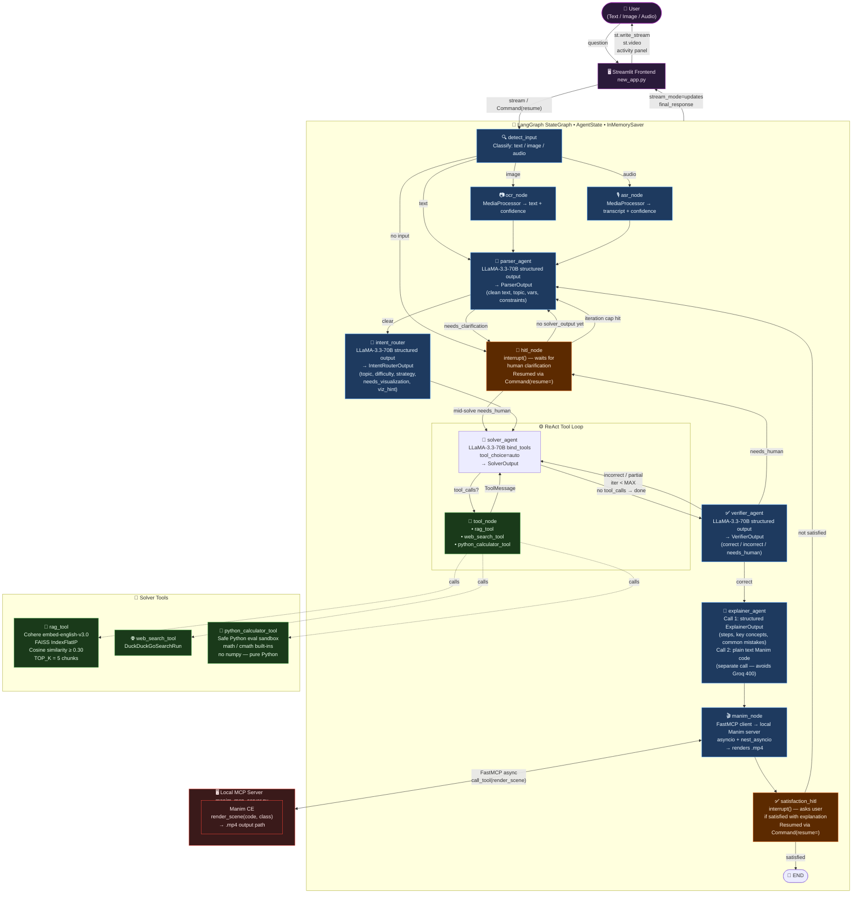

# 🧮 Math Tutor Agent

An AI-powered JEE mathematics tutor built with **LangGraph**, **Streamlit**, and **Groq (LLaMA 3.3 70B)**. The system accepts text, image (OCR), or audio (ASR) input, solves problems step-by-step using a multi-agent ReAct pipeline, verifies its own answers, generates rich explanations, and can render animated **Manim visualisations** via a local MCP server — all with human-in-the-loop checkpoints at every ambiguous decision.

---

## ✨ Features

| Feature | Details |
|---|---|
| **Multi-modal input** | Text, image (OCR), or audio (ASR) |
| **Multi-agent pipeline** | Parser → Intent Router → Solver → Verifier → Explainer |
| **ReAct tool loop** | RAG (PDF), Web Search (DuckDuckGo), Python Calculator |
| **RAG over student PDFs** | Cohere `embed-english-v3.0` + FAISS `IndexFlatIP` (cosine similarity) |
| **Human-in-the-Loop** | Clarification HITL (ambiguous problems) + Satisfaction HITL (post-answer) |
| **Manim visualisation** | Auto-generated animations via local FastMCP server |
| **Conversation threads** | LangGraph `InMemorySaver` checkpointing per thread |
| **Activity panel** | Live agent activity sidebar showing every node decision |

---

## 🏗️ Architecture



---

## 📁 Project Structure

```
MathTutor/
├── src/
│   ├── backend/
│   │   ├── agents.py              # LangGraph graph, all agent nodes, HITL logic
│   │   ├── exceptions.py          # Agent_Exception with file + line info
│   │   ├── logger.py              # Structured logger
│   │   ├── tools/
│   │   │   └── tools.py           # rag_tool, web_search_tool, ingest_pdf, FAISS store
│   │   └── utils/
│   │       ├── artifacts.py       # Pydantic output schemas (Parser/Solver/Verifier/Explainer)
│   │       └── helper.py          # MediaProcessor (OCR/ASR), python_calculator sandbox
│   └── frontend/
│       └── new_app.py             # Streamlit UI, streaming, HITL widgets, activity panel
├── manim_mcp_server.py            # FastMCP server — renders Manim scenes to .mp4
├── .env                           # API keys (git-ignored)
├── .env.example                   # Template for .env
├── .gitignore
├── requirements.txt
└── README.md
```

---

## 🔄 Agent Flow — Step by Step

1. **detect_input** — classifies input as `text`, `image`, or `audio`. Routes to OCR/ASR if needed.
2. **ocr_node / asr_node** — extracts text from image or audio using `MediaProcessor`.
3. **parser_agent** — cleans OCR/ASR noise, normalises math notation, identifies variables and constraints. If genuinely ambiguous → triggers `hitl_node`.
4. **hitl_node** *(clarification)* — `interrupt()` pauses the graph. User types clarification → resumed via `Command(resume=answer)`. Routes back to parser or continues to solver depending on context.
5. **intent_router** — classifies topic, difficulty, solver strategy. Decides if a Manim visualisation is needed.
6. **solver_agent ↔ tool_node** *(ReAct loop)* — LLaMA 3.3 70B with `bind_tools`. Each turn is either a tool call OR a final written answer — never mixed. Tools: `rag_tool` (PDF search), `web_search_tool`, `python_calculator_tool`.
7. **verifier_agent** — checks the solution for correctness, domain validity, edge cases. Routes to explainer (correct), retry solver (wrong), or HITL (uncertain).
8. **explainer_agent** — two separate LLM calls: ① structured `ExplainerOutput` (steps, key concepts, common mistakes) ② plain text Manim code (separate call to avoid Groq 400 on large code strings in function-calling schema).
9. **manim_node** — calls local FastMCP server asynchronously to render the Manim scene. Uses `nest_asyncio` to work inside Streamlit's event loop.
10. **satisfaction_hitl** — `interrupt()` asks if the student is satisfied. Yes → `END`. No → back to `parser_agent` with feedback.

---

## ⚙️ Setup

### 1. Clone & create environment

```bash
git clone https://github.com/your-username/MathTutor.git
cd MathTutor
python -m venv myenv
# Windows
myenv\Scripts\activate
# macOS / Linux
source myenv/bin/activate
```

### 2. Install dependencies

```bash
pip install -r requirements.txt
```

### 3. Configure environment variables

```bash
cp .env.example .env
```

Edit `.env`:

```env
GROQ_API_KEY=your_groq_api_key
COHERE_API_KEY=your_cohere_api_key

# Optional — Manim MCP server
MANIM_MCP_SERVER_URL=http://localhost:8765/mcp
MANIM_OUTPUT_DIR=./manim_outputs
MANIM_SERVER_PORT=8765
```

### 4. (Optional) Start Manim MCP server

Required only if you want animated visualisations. Needs `manim` and `fastmcp` installed.

```bash
pip install manim fastmcp nest_asyncio
python manim_mcp_server.py
```

### 5. Run the app

```bash
streamlit run src/frontend/new_app.py
```

---

## 🔑 API Keys Required

| Service | Used for | Get it at |
|---|---|---|
| **Groq** | LLaMA 3.3 70B inference (all agents) | [console.groq.com](https://console.groq.com) |
| **Cohere** | PDF chunk embeddings (`embed-english-v3.0`) | [cohere.com](https://cohere.com) |

---

## 🧰 Tech Stack

| Layer | Technology |
|---|---|
| **LLM** | LLaMA 3.3 70B Versatile via Groq |
| **Agent orchestration** | LangGraph (`StateGraph`, `interrupt`, `InMemorySaver`) |
| **Frontend** | Streamlit |
| **Embeddings** | Cohere `embed-english-v3.0` (1024-dim) |
| **Vector search** | FAISS `IndexFlatIP` (cosine similarity) |
| **PDF ingestion** | LangChain `PyPDFLoader` + `RecursiveCharacterTextSplitter` |
| **Web search** | DuckDuckGo (`langchain_community`) |
| **Visualisation** | Manim Community Edition + FastMCP |
| **Async bridging** | `nest_asyncio` (Streamlit ↔ asyncio) |

---

## 🛡️ Known Limitations

- **In-memory RAG** — FAISS index is lost on Streamlit restart. Re-upload your PDF after restarting.
- **Groq rate limits** — `llama-3.3-70b-versatile` has token-per-minute limits. Heavy multi-tool solver turns may hit them.
- **Manim server** — must be running separately. If unavailable, the explanation still shows; only the video is skipped.
- **`np` not available in calculator** — the `python_calculator_tool` sandbox exposes `math` and `cmath` but not `numpy`. Use `math.sqrt` instead of `np.sqrt`.

---

## 📄 License

MIT License. See `LICENSE` for details.